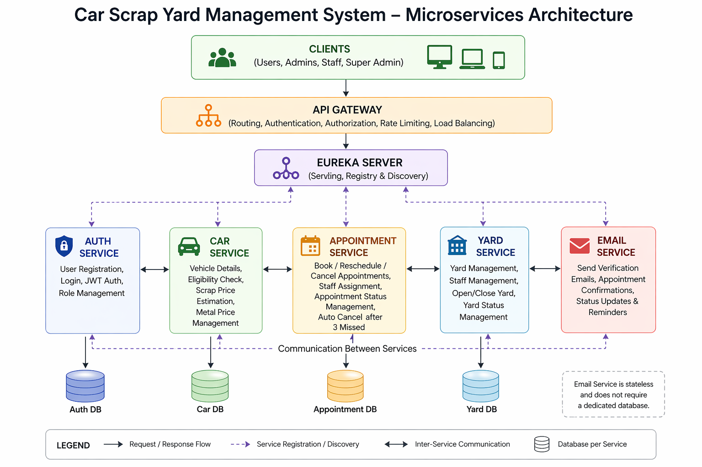
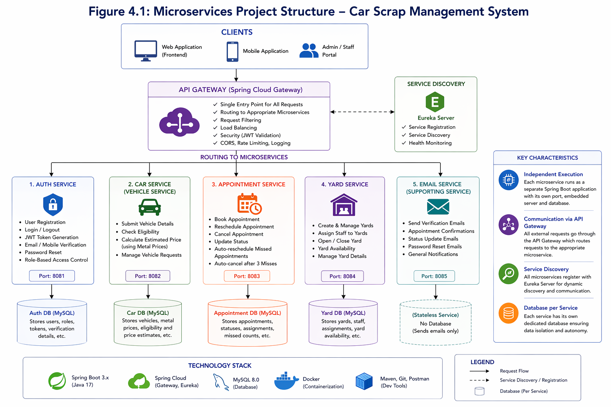
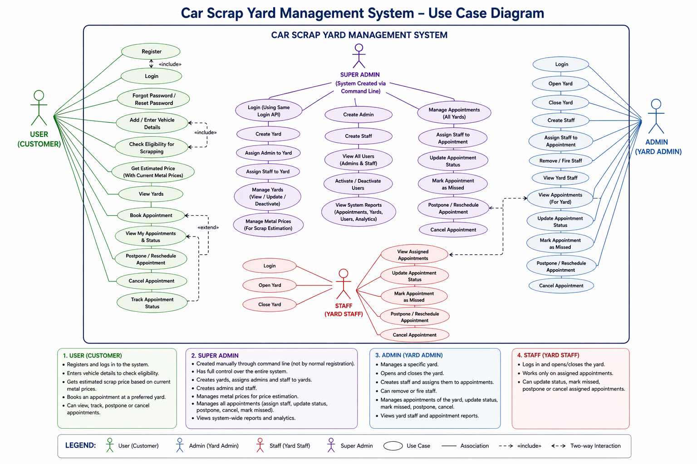
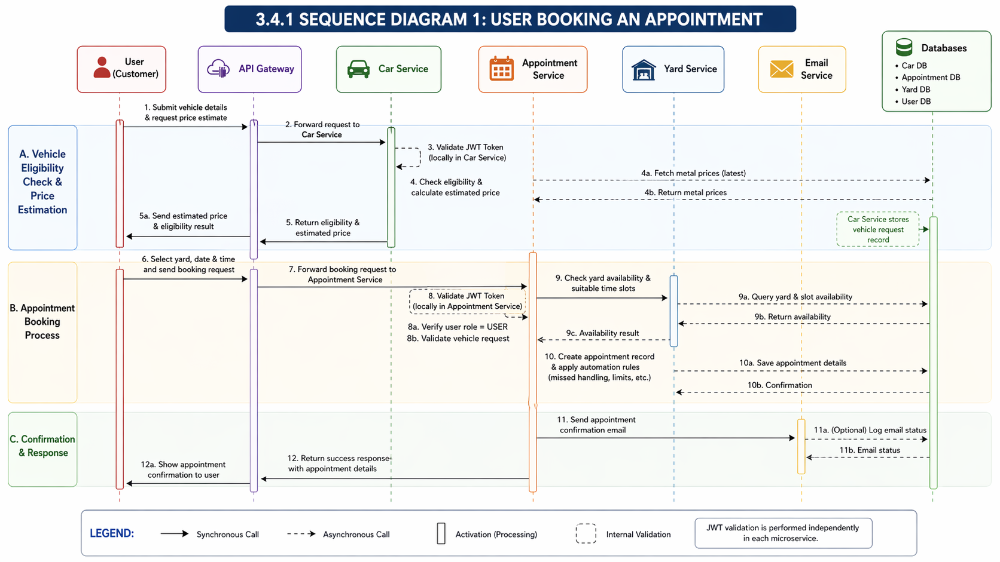
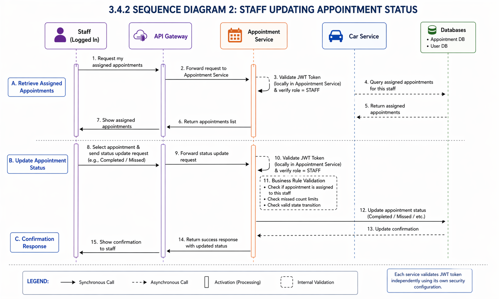

<div align="center">

# 🚗 Car Scrap Yard Management System

### Production-Inspired Microservices Backend using Spring Boot, Docker & JWT Security

<p align="center">
  
  
  
  
  
  
</p>

<p align="center">
  <a href="https://github.com/yaseenpatelsd/carscrap-microservices-system">
    
  </a>
</p>

</div>

---

# 📌 Overview

Car Scrap Yard Management System is a production-inspired backend application built using a distributed microservices architecture.

The project simulates a real-world scrap yard management platform where users can:

* Register and authenticate securely
* Search scrap yards
* Book vehicle scrap appointments
* Reschedule or cancel appointments
* Track appointment workflows
* Receive automated email notifications

The platform also supports complete operational management through:

* Super Admin
* Admin
* Staff
* User

roles with different responsibilities and permissions.

---

# 🏗️ System Architecture

<div align="center">
  
</div>

<div align="center">
  <i>Complete Microservices Architecture Overview</i>
</div>

---

## 🔄 Request Flow

```txt
Client → NGINX → API Gateway → Eureka Service Discovery → Microservices → Dedicated Databases
```

All requests pass through the API Gateway, which handles:

* Request routing
* JWT validation
* Centralized access control
* Load balancing
* Inter-service communication routing

The system uses Eureka Service Registry for dynamic service discovery.

---

# 🧩 Core Services

| Service         | Responsibility                 |
| --------------- | ------------------------------ |
| Auth Service    | Authentication & Authorization |
| Booking Service | Appointment workflows          |
| Car Service     | Vehicle validation & pricing   |
| Yard Service    | Yard & staff management        |
| Email Service   | Notifications & verification   |
| API Gateway     | Centralized routing & security |
| Eureka Server   | Dynamic service discovery      |

---

# 🗄️ Database Architecture

Each microservice uses its own dedicated database schema:

* auth_db
* booking_db
* car_db
* yard_db

This separation improves:

* Loose coupling
* Service isolation
* Maintainability
* Independent data ownership

The databases run inside a Dockerized MySQL environment.

---

# 📊 Project Structure Diagram

<div align="center">
  
</div>

<div align="center">
  <i>Microservices Project Structure & Technology Stack</i>
</div>

---

# 👥 Use Case Diagram

<div align="center">
  
</div>

<div align="center">
  <i>System Use Cases & Role Interactions</i>
</div>

---

# 🔁 Sequence Diagrams

## 📅 Appointment Booking Workflow

<div align="center">
  
</div>

<div align="center">
  <i>User Appointment Booking Flow Across Microservices</i>
</div>

---

## 👷 Staff Appointment Status Workflow

<div align="center">
  
</div>

<div align="center">
  <i>Staff Appointment Status Update Workflow</i>
</div>

---

# ✨ Features

## 👤 User Features

* Register & Login
* Search yards by:

  * City
  * State
  * Pincode
  * Yard Name
* Vehicle eligibility checks
* Scrap price estimation
* Book appointments
* Cancel appointments
* Reschedule appointments
* Track appointment status

---

## 🛡️ Super Admin Features

* Create yards
* Create admins
* Create staff
* Assign admins to yards
* Assign staff to yards
* Manage system operations

### Yard Rules

* One yard can have:

  * One admin
  * Multiple staff members

---

## 🏢 Admin Features

* Open / Close yard
* Manage yard staff
* Assign staff to appointments
* Update yard details
* Approve appointments
* Mark appointments as missed
* Mark appointments as completed

---

## 👷 Staff Features

* Manage assigned appointments
* Update appointment status
* Open / Close assigned yard
* Complete assigned tasks

---

# 🔄 Communication Patterns

The system uses both synchronous and asynchronous communication.

## Synchronous Communication

* REST APIs
* OpenFeign Clients

Used for:

* Yard validation
* Appointment processing
* Authentication workflows

---

## Async Event-Driven Communication

The project uses Spring Boot's built-in application event system for asynchronous internal event handling.

This is implemented using:

* Spring Events (`ApplicationEventPublisher`)
* `@EventListener`
* `@Async`

The Email Service is triggered asynchronously for:

* Appointment confirmation emails
* Password reset emails
* Verification emails
* Appointment status updates
* Reminder notifications

This approach helps:

* Reduce request blocking
* Improve responsiveness
* Decouple notification workflows
* Prevent email operations from slowing down API responses

> Note: This project currently uses Spring's internal event-driven mechanism and does not use external message brokers such as Kafka or RabbitMQ.

---

# 🛡️ Resilience Features

To improve fault tolerance between microservices, the system implements:

* Retry Mechanism
* Circuit Breaker Pattern
* Fallback Handling

These are primarily used during communication with the Email Service to prevent complete request failures when notification services are temporarily unavailable.

Implemented using:

* Spring Retry
* Resilience4j

---

# 🔐 Security

The system uses:

* JWT Authentication
* Spring Security
* Role-Based Authorization
* Protected APIs
* Environment Variable Based Secret Management

Sensitive information such as:

* Database passwords
* JWT secrets
* Email credentials

are stored using `.env` files and excluded using `.gitignore`.

---

# 🧰 Tech Stack

<div align="center">

| Backend         | DevOps         | Database      | Frontend   |
| --------------- | -------------- | ------------- | ---------- |
| Java 17         | Docker         | MySQL 8       | HTML       |
| Spring Boot     | Docker Compose | JPA/Hibernate | CSS        |
| Spring Security | NGINX          |               | JavaScript |
| Spring Cloud    | GitHub         |               |            |
| Eureka          | Maven          |               |            |
| OpenFeign       | Postman        |               |            |
| Resilience4j    |                |               |            |

</div>

---

# 🌐 Service Ports

| Service         | Port |
| --------------- | ---- |
| API Gateway     | 8080 |
| Auth Service    | 8081 |
| Email Service   | 8082 |
| Car Service     | 8083 |
| Booking Service | 8084 |
| Yard Service    | 8085 |
| Eureka Server   | 8761 |

---

# 📂 Project Structure

```txt
CarScrapProject/
│
├── AUTH-SERVICE/
├── Booking-Service/
├── car-service/
├── yard-service/
├── Email_Service/
├── gateway/
├── service-registry/
├── frontend/
├── nginx/
├── docker-compose.yml
└── README.md
```

---

# 🐳 Dockerized Deployment

The complete system is containerized using Docker Compose.

### Services Running in Containers

* API Gateway
* Eureka Registry
* MySQL
* NGINX
* All Spring Boot Microservices

Each service runs independently inside its own containerized environment.

---

# 🚀 Running the Project

## Clone Repository

```bash
git clone https://github.com/yaseenpatelsd/carscrap-microservices-system.git
```

---

## Start Docker Containers

```bash
docker-compose up --build
```

---

# 📈 Key Highlights

✅ Microservices Architecture
✅ API Gateway Pattern
✅ Eureka Service Discovery
✅ JWT Authentication & Authorization
✅ Dockerized Deployment
✅ Dedicated Database Per Service
✅ Async Event-Driven Communication
✅ Retry Mechanism
✅ Circuit Breaker & Fallback Handling
✅ Role-Based Access Control
✅ Appointment Automation Logic
✅ Yard & Staff Management
✅ Email Notification System

---

# 🚀 Future Improvements

* Kubernetes Deployment
* RabbitMQ / Kafka Integration
* Redis Caching
* CI/CD Pipeline
* Monitoring with Prometheus & Grafana
* Centralized Logging
* SMS Notifications
* Payment Integration

---

# 📚 Learning Outcomes

This project helped in understanding:

* Microservices Architecture
* Distributed Systems
* Docker Containerization
* Service Discovery
* API Gateway Pattern
* JWT Security
* Fault Tolerance Patterns
* Backend Scalability
* Real-world Backend Design
* Inter-service Communication

---

<div align="center">

## 👨‍💻 Author

### Yaseen Patel

Backend Developer | Java & Spring Boot Enthusiast

<a href="https://github.com/yaseenpatelsd">GitHub Profile</a>

</div>

---

<div align="center">

Built for learning, portfolio, and backend engineering practice.

</div>
