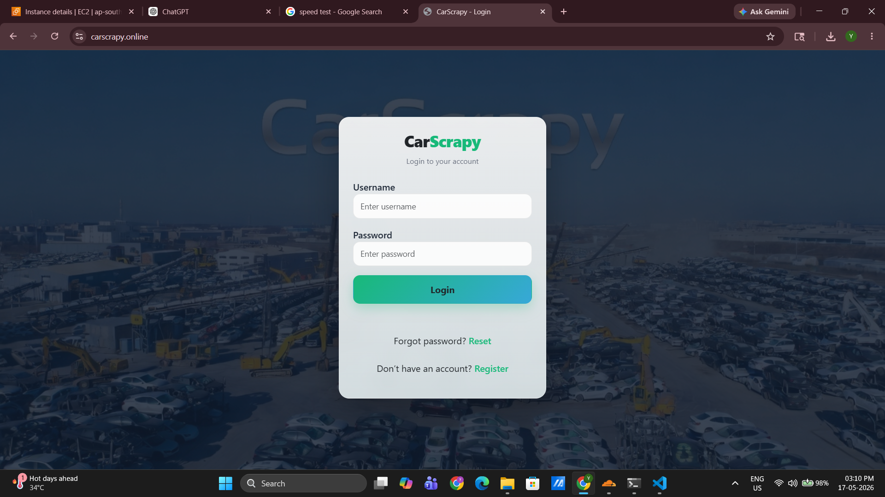
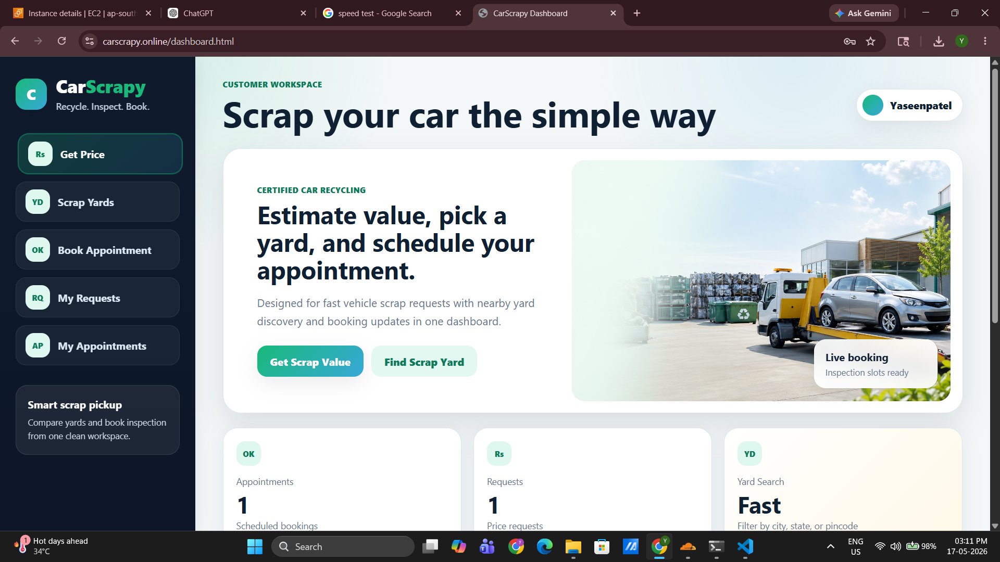
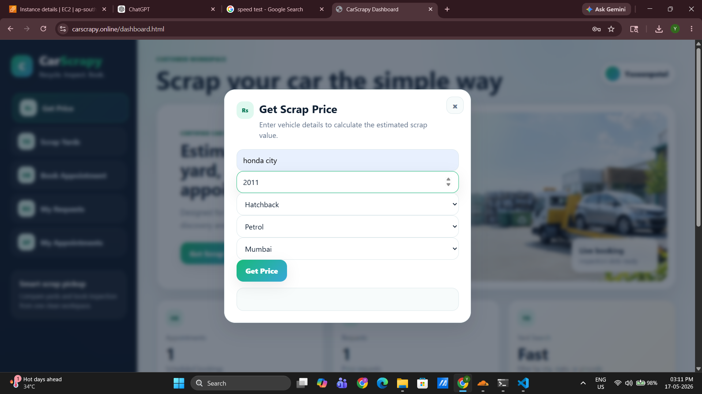
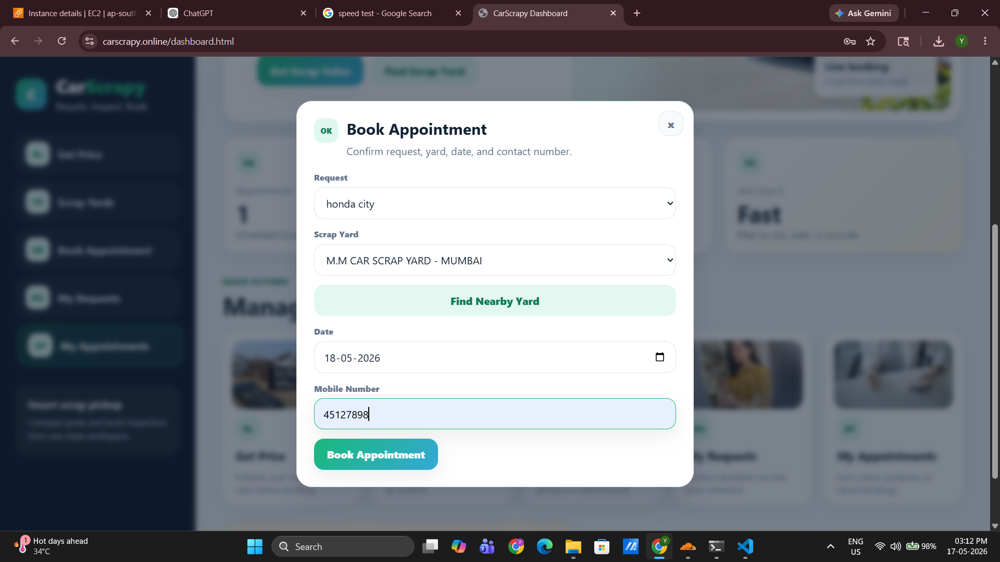
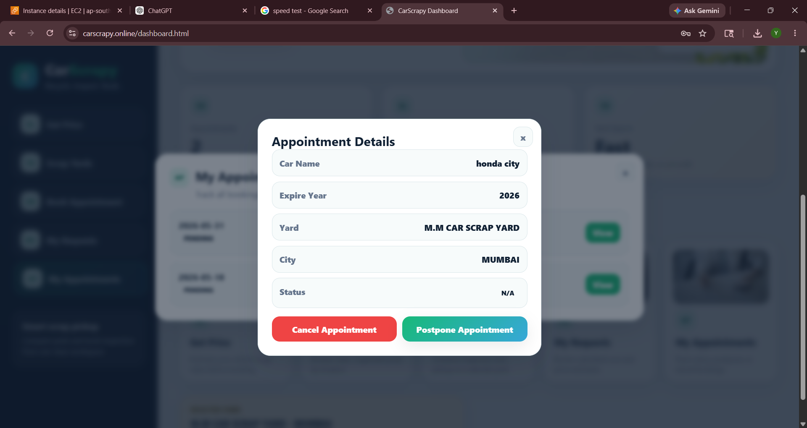

# 🚗 Car Scrap Yard Management System

### Production-Inspired Microservices Platform using Spring Boot, Docker & JWT Security

<div align="center">

<p align="center">
  
  
  
  
  
  
</p>

</div>

---

# 📌 Overview

Car Scrap Yard Management System is a production-inspired distributed backend application built using a microservices architecture.

The platform simulates a real-world vehicle scrap management system where users can:

- Register and authenticate securely
- Search nearby scrap yards
- Estimate scrap prices
- Book appointments
- Cancel or reschedule bookings
- Track appointment workflows
- Receive automated email notifications

The system also supports operational management through multiple roles:

- Super Admin
- Admin
- Staff
- User

---

# 🌐 Live Deployment

The project is deployed on AWS EC2 for portfolio and backend engineering practice purposes.

## 🔗 Live Website

https://carscrapy.online

---

# ☁️ Deployment Environment

- AWS EC2 (Ubuntu Server)
- Docker Compose
- NGINX Reverse Proxy
- HTTPS Enabled
- Custom Domain Configuration
- Dockerized Spring Boot Microservices
- Dockerized MySQL Databases

---

# ⚠️ Availability Note

Since this is a self-hosted learning project running on a limited cloud budget,
availability may occasionally vary during maintenance or server shutdown periods.

---

# 📸 Deployment Evidence

## 🔐 Login Page

<div align="center">
  
</div>

---

## 📊 Dashboard

<div align="center">
  
</div>

---

## 💰 Scrap Price Estimation Workflow

<div align="center">
  
</div>

---

## 📅 Appointment Booking Workflow

<div align="center">
  
</div>

---

## 📄 Appointment Management

<div align="center">
  
</div>

---

# ☁️ Production Deployment Architecture

```txt
Client Browser
       ↓
carscrapy.online
       ↓
NGINX (Ubuntu Host Machine)
       ↓
API Gateway (Docker Container)
       ↓
Eureka Service Discovery
       ↓
Spring Boot Microservices
       ↓
MySQL Databases (Docker Containers)
```

---

# 🧩 Core Services

| Service | Responsibility |
|---|---|
| Auth Service | Authentication & Authorization |
| Booking Service | Appointment workflows |
| Car Service | Vehicle validation & pricing |
| Yard Service | Yard & staff management |
| Email Service | Notifications & verification |
| API Gateway | Centralized routing & security |
| Eureka Server | Dynamic service discovery |

---

# 🔐 Security

The system uses:

- JWT Authentication
- Spring Security
- Role-Based Authorization
- Protected APIs
- Environment Variable Based Secret Management

---

# 🐳 Dockerized Infrastructure

## Containerized Services

- API Gateway
- Eureka Registry
- Spring Boot Microservices
- MySQL Databases

## Host-Level Services

- NGINX Reverse Proxy

---

# 🧰 Tech Stack

| Backend | DevOps | Database | Frontend |
|---|---|---|---|
| Java 17 | Docker | MySQL 8 | HTML |
| Spring Boot | Docker Compose | JPA/Hibernate | CSS |
| Spring Security | NGINX |  | JavaScript |
| Spring Cloud | AWS EC2 |  |  |
| Eureka | Ubuntu |  |  |
| OpenFeign | Maven |  |  |
| Resilience4j | GitHub |  |  |

---

# 🚀 Running the Project

## Clone Repository

```bash
git clone https://github.com/yaseenpatelsd/carscrap-microservices-system.git
```

## Start Docker Containers

```bash
docker-compose up --build
```

---

# 📈 Key Highlights

✅ Microservices Architecture  
✅ API Gateway Pattern  
✅ Eureka Service Discovery  
✅ JWT Authentication & Authorization  
✅ Dockerized Deployment  
✅ Dedicated Database Per Service  
✅ Async Event-Driven Communication  
✅ Retry Mechanism  
✅ Circuit Breaker & Fallback Handling  
✅ Role-Based Access Control  
✅ AWS EC2 Deployment  
✅ HTTPS Enabled Production Access  

---

# 👨‍💻 Author

## Yaseen Patel

Backend Developer | Java & Spring Boot Enthusiast

GitHub:
https://github.com/yaseenpatelsd

---

Built for learning, portfolio, and backend engineering practice.
